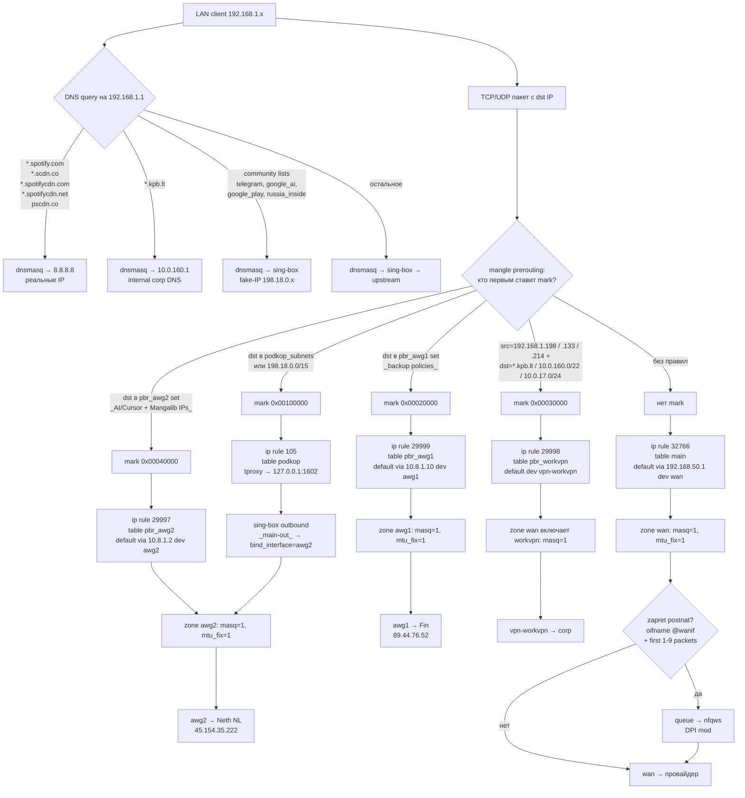

# Xiaomi X3000T (OpenWrt 24.10) — актуальная схема

> **Статус:** living reference  
> **Последняя проверка:** 2026-06-14

Справочник по **текущей** домашней конфигурации. Ключи AmneziaWG, пароли и токены в репозиторий не копировать.

**LuCI** с LAN (`192.168.1.0/24`):

- [http://192.168.1.1/](http://192.168.1.1/)
- [http://openwrt.lan/cgi-bin/luci/](http://openwrt.lan/cgi-bin/luci/)

---

## Топология

Провайдер → **WAN Xiaomi/OpenWrt** (DHCP, белый IP `5.189.245.251`) → две firewall zone на X3000T:

- `lan` `192.168.1.0/24` — клиенты (ПК, Mac, телефоны), порты `lan3 lan4` X3000T + WiFi. Здесь работает вся машинерия: pbr / podkop / sing-box / zapret / awg1 / awg2 / workvpn.
- `srv` `192.168.50.0/24` — Proxmox + ВМ, отдельный физический порт `lan2` X3000T. Forwarding только `srv→wan` и `lan→srv`. **Никаких** туннелей и DPI: zapret bypass-нут по `ct original ip saddr 192.168.50.0/24 return`.

Проброс портов, белый IP, DDNS, NAT — на OpenWrt X3000T. Общий контекст дома: [`hardware-and-env.md`](../overview/hardware-and-env.md).

---

## Прошивка


| Параметр   | Значение                                                              |
| ---------- | --------------------------------------------------------------------- |
| Устройство | Xiaomi X3000T                                                         |
| Система    | **OpenWrt 24.10.6** (`r29141-81be8a8869`), LuCI ветка `openwrt-24.10` |


---

## Цель маршрутизации (как сейчас)

```text
Primary tunnel (2026-06-02) → awg2 (Neth NL); awg1 (Fin) — backup
Обычный трафик              → WAN → провайдер
Автообход блокировок        → podkop + sing-box → bind_interface=awg2 (primary)
AI / Cursor домены          → pbr «AI Tools via awg2 (global)» → awg2
Mangalib                    → pbr «Mangalib via awg2» → awg2
Optimizely                  → pbr «Optimizely via awg2» → awg2
Spotify                     → podkop → sing-box → awg2 (SNI proxy мёртв с 2026-05-20)
Корпоративные домены        → pbr workvpn (paul-mac / pundef-pc / xiaomi-13t-pro)
DPI                         → zapret / nfqws на WAN-потоках
Default route               → всегда WAN, не в туннели
Failover awg1 ⇄ awg2        → scripts/openwrt/switch_primary_tunnel_safe.py
```

### Кто за что отвечает

- **dnsmasq** — корневой резолвер LAN (`192.168.1.1:53`). Имеет per-domain upstream:
  - `*.spotify.com`, `*.scdn.co`, `*.spotifycdn.com/.net`, `pscdn.co` → `8.8.8.8` (мимо подкопа), чтобы получать **реальные** IP, а не fake-IP.
  - `*.kpb.lt` → `10.0.160.1` (внутренний DNS workvpn); pin `gitlab.kpb.lt` → `10.0.17.5`.
  - всё остальное → `127.0.0.42` (DNS-инбаунд `sing-box` подкопа: rule_set + fake-IP).
- **pbr** — выбор маршрута по `dst_addr` (через `nftset`-сеты) и/или `src_addr`. Раздаёт mark, ставит `ip rule` в свои таблицы.
- **podkop / sing-box** — основной автообход. `podkop.main.interface=awg2` (primary с 2026-06-02): tproxy → sing-box → `bind_interface` = primary.
- **AmneziaWG `awg1`** — Fin VPS (`89.44.76.52`). **Backup** (проверен 2026-06-02: endpoint и egress OK; primary — `awg2`).
- **AmneziaWG `awg2`** — Neth NL (`45.154.35.222`). **Primary** для podkop, pbr AI/Mangalib, GitHub community-list routes, `srv→awg2` (OwnCord ghcr).
- **OpenConnect `vpn-workvpn`** — корпоративный VPN, поднимается с парой `username/password`, split-routing для клиентов с pbr-policy (сейчас `paul-mac` `192.168.1.198`, `pundef-pc` `192.168.1.133`, `xiaomi-13t-pro` `192.168.1.214`) и `*.kpb.lt`.
- **zapret / nfqws** — модификация первых пакетов TCP/UDP уже выбранных WAN-потоков; маршрут не выбирает.

---

## Древовидная схема: путь пакета

Дерево читается сверху вниз: пакет приходит с LAN, проходит DNS-стадию (резолв) и стадию решения о маршруте, и в конце уходит через один из выходов.




Ключевые свойства схемы:

- **Default всегда `wan`.** Сами VPN-туннели поднимаются с `defaultroute=0`, чтобы не ломать остальной интернет.
- `**pbr` и `podkop` смотрят на разные mark-биты** (`0x00ff0000` против `0x0f000000`), не пересекаются.
- `**zapret` появляется ТОЛЬКО на WAN-ветке** (`oifname @wanif`); для пакетов в `awg1`/`awg2`/`workvpn` он не работает.
- **Spotify** с 2026-05-20 идёт через podkop (fake-IP) → primary tunnel; отдельная pbr-policy «Spotify via awg2» снята.

---

## Текущие правила маршрутизации


| Priority | Условие                               | Таблица       | Что значит                                       |
| -------- | ------------------------------------- | ------------- | ------------------------------------------------ |
| `105`    | `fwmark 0x100000/0x100000`            | `podkop`      | подкоп tproxy / sing-box (главный обход)         |
| `29997`  | `fwmark 0x40000/0xff0000`             | `pbr_awg2`    | pbr AI / Mangalib / ai-frontend-ghcr (primary)   |
| `29998`  | `fwmark 0x30000/0xff0000`             | `pbr_workvpn` | corp clients `*.kpb.lt`                          |
| `29999`  | `fwmark 0x20000/0xff0000`             | `pbr_awg1`    | backup table (Fin); rules остаются для failover  |
| `29998`  | `lookup main suppress_prefixlength 1` | `main`        | local/специфичные маршруты, default подавлен     |
| `30000`  | `fwmark 0x10000/0xff0000`             | `pbr_wan`     | pbr-uplink, явно вернуть в WAN при необходимости |
| `32766`  | без mark                              | `main`        | default через `wan`                              |


Содержимое таблиц:

```sh
ip route
# default via 192.168.50.1 dev wan
# 89.44.76.52 via 192.168.50.1 dev wan         # Fin endpoint
# 45.154.35.222 via 192.168.50.1 dev wan       # Neth endpoint
# 140.82.112.0/20 dev awg2 scope link          # github API (community lists, primary)
# 185.199.108.0/22 dev awg2 scope link         # github raw

ip route show table pbr_awg1   # default via 10.8.1.10 dev awg1
ip route show table pbr_awg2   # default via 10.8.1.2  dev awg2
ip route show table pbr_workvpn # default dev vpn-workvpn
```

Endpoints VPN-серверов (`89.44.76.52`, `45.154.35.222`) обязательно остаются доступны через `wan`, чтобы туннель не пытался завернуться сам в себя.

---

## Сценарии (по доменам)

### Обычный сайт

1. dnsmasq → sing-box (т.к. нет per-domain upstream и нет community match).
2. sing-box возвращает реальный IP.
3. mark не ставится → `lookup main` → `default dev wan`.
4. На выходе `zapret postnat` может модифицировать первые пакеты для DPI-обхода.

### Сайт из community list (Telegram, Google Play, и т.п.)

1. dnsmasq → sing-box; sing-box матчит rule_set → возвращает fake-IP `198.18.0.x`.
2. Пакет с `dst=198.18.0.x` ловится в `PodkopTable mangle` → mark `0x00100000`.
3. `ip rule 105` → `table podkop` → tproxy на `127.0.0.1:1602`.
4. sing-box разрешает fake-IP в реальный, отправляет через `main-out` (bind primary, `awg2`).
5. Выход через `awg2 → Neth NL`.

### AI / Cursor (`api.openai.com`, `chatgpt.com`, `claude.ai`, ...)

1. dnsmasq → sing-box → реальный IP (SNI-пины в `/etc/hosts` сняты 2026-06-02).
2. `dnsmasq nftset` добавляет IP в `pbr_awg2_*` set.
3. `pbr_prerouting` → mark `0x00040000`.
4. `ip rule 29997` → `table pbr_awg2` → `default via 10.8.1.2 dev awg2` → Neth.

### Spotify

1. **Сейчас (с 2026-05-20):** Spotify-пины сняты; трафик через podkop → primary tunnel (`awg2` с 2026-06-02). Premium NG-профиль может показывать `country does not match profile` — ожидаемо.
2. **2026-05-13 — 2026-05-20:** Spotify шёл через SNI proxy `45.155.204.190` (FI), пины в `/etc/hosts`. Сломалось 2026-05-20: proxy перестал отвечать (`ping 100% loss`, `TCP/443 timeout`), клиент висел. Поэтому пины убрали. Откат: раскомментировать строки `#Spotify` в [scripts/openwrt/etc-hosts](../../scripts/openwrt/etc-hosts), залить, `dnsmasq restart` — но только когда proxy оживёт (или появится альтернативный IP).
3. **Историческая попытка через NL** (`awg2 + pbr-policy + dnsmasq bypass`) была собрана и снесена 2026-05-13: любой европейский egress (FI/NL) одинаково триггерит "country does not match profile", независимо от того, NL это или FI. Чинить нужно на стороне аккаунта (сменить страну профиля через NG-IP). awg2-туннель оставлен как backup VPN.

### Корпоративные ресурсы `*.kpb.lt` (workvpn-клиенты)

Клиенты с **активной** pbr-policy: `paul-mac` (`192.168.1.198`), `pundef-pc` (`192.168.1.133`, Win + WSL mirrored — Cursor Remote SSH, см. [zapret-bypass-pundef-pc-2026-05-27.md](incidents/zapret-bypass-pundef-pc-2026-05-27.md)), `xiaomi-13t-pro` (`192.168.1.214`, Android). Включить/перенастроить клиента: [`scripts/openwrt/enable-workvpn-client.sh`](../../scripts/openwrt/enable-workvpn-client.sh) (безопасно с ПК: [`enable_workvpn_client_safe.py`](../../scripts/openwrt/enable_workvpn_client_safe.py) — baseline/post `check_stack`, авто-откат; см. [router-resilience.md](router-resilience.md)). Откат телефона: [`rollback-workvpn-xiaomi-13t-pro.sh`](../../scripts/openwrt/rollback-workvpn-xiaomi-13t-pro.sh).

1. dnsmasq: `server=/kpb.lt/10.0.160.1`, pin `address=/gitlab.kpb.lt/10.0.17.5` → corp DNS через `vpn-workvpn`.
2. `pbr_prerouting` сматчил `src=<client-ip> + dst @kpb_set | 10.0.160.0/22 | 10.0.17.0/24` → mark `0x00030000`.
3. `ip rule 29998` → `table pbr_workvpn` → `vpn-workvpn`.
4. На Android-телефоне: **Private DNS выключить**; **MAC randomization выключить** (использовать MAC устройства, иначе резервация не сработает); в **Chrome → Secure DNS → Off** (иначе corp-DNS обходится); переподключить Wi-Fi.

---

## Где именно вмешивается `zapret`

`zapret` живёт в `table inet zapret`, реагирует только на WAN-ветку (`oifname @wanif = wan`):

```sh
chain postnat {
    ct original ip saddr 192.168.1.227 return comment "zapret-ct-bypass-227"   # phoneserver
    ct original ip saddr 192.168.1.133 return comment "zapret-ct-bypass-133"   # pundef-pc
    ct original ip saddr 192.168.1.214 return comment "zapret-ct-bypass-214"   # xiaomi-13t-pro
    ct original ip saddr 192.168.50.0/24 return comment "zapret-ct-bypass-srv"
    oifname @wanif udp ... queue flags bypass to 200
    oifname @wanif tcp dport ... ct original packets 1-9 ... queue flags bypass to 200
}

chain prenat {
    ct reply ip daddr 192.168.1.227 return comment "zapret-ct-bypass-227-pre"
    ct reply ip daddr 192.168.1.133 return comment "zapret-ct-bypass-133-pre"
    ct reply ip daddr 192.168.1.214 return comment "zapret-ct-bypass-214-pre"
    ct reply ip daddr 192.168.50.0/24 return comment "zapret-ct-bypass-srv-pre"
    iifname @wanif tcp sport ... ct reply packets 1-3 ... queue flags bypass to 200
}
```

Что важно:

- для `awg1`/`awg2`/`workvpn` zapret не срабатывает (другой выходной интерфейс);
- работает только на первых пакетах TCP/UDP конкретных портов;
- для конкретного устройства можно сделать **per-device bypass** (см. ниже).

### Per-device bypass для zapret

Сейчас bypass включён для **`192.168.1.227`** (phoneserver **wlan**, Voice PE / Groq), **`192.168.50.0/24`** (srv, включая phoneserver eth `.127`), **`192.168.1.133`** / **`192.168.1.208`** (`pundef-pc`, см. [gaming-pc-routes.md](gaming-pc-routes.md)), **`192.168.1.214`** (`xiaomi-13t-pro`). Eth phoneserver MAC `dc:04:5a:58:5a:93` → DHCP srv `.127` ([`reserve-phoneserver-dhcp.sh`](../../scripts/openwrt/reserve-phoneserver-dhcp.sh)).

- hook `INIT_FW_POST_UP_HOOK=/opt/zapret/custom.bypass_devices.sh` в `/opt/zapret/config`;
- скрипт `/opt/zapret/custom.bypass_devices.sh` (исходник: [scripts/openwrt/custom.bypass_devices.sh](../../scripts/openwrt/custom.bypass_devices.sh)) после каждого `zapret restart` досыпает правила `ct original/reply ... return`.

Если устройство сменит IP (например, MAC randomization без DHCP-резервации), bypass и pbr-policy перестанут срабатывать. В этом случае вернуть пин по MAC в `dhcp.@host` и обновить `custom.bypass_devices.sh` / pbr-policy.

Добавить ещё устройство (пример `192.168.1.240`):

```sh
nft insert rule inet zapret postnat ct original ip saddr 192.168.1.240 return comment "zapret-ct-bypass-240"
nft insert rule inet zapret prenat ct reply ip daddr 192.168.1.240 return comment "zapret-ct-bypass-240-pre"
```

---

## Mark-и (диапазоны не должны пересекаться)


| Компонент          | Mark / ct mark             | Где используется                                   | Зачем                                    |
| ------------------ | -------------------------- | -------------------------------------------------- | ---------------------------------------- |
| `pbr` (awg2)       | `0x00040000/0xff0000`      | `ip rule 29997`, table `pbr_awg2`                  | AI / Mangalib / ghcr (primary)             |
| `pbr` (workvpn)    | `0x00030000/0xff0000`      | `ip rule 29998`, table `pbr_workvpn`               | corp `*.kpb.lt`                          |
| `pbr` (awg1)       | `0x00020000/0xff0000`      | `ip rule 29999`, table `pbr_awg1`                  | backup (Fin)                             |
| `pbr` (uplink)     | `0x00010000/0xff0000`      | `ip rule 30000`, table `pbr_wan`                   | принудительный return в WAN              |
| `podkop`           | `0x00100000`               | `PodkopTable mangle/proxy`, `ip rule priority 105` | tproxy в sing-box                        |
| `zapret` / `nfqws` | `0x20000000`, `0x40000000` | `table inet zapret`, conntrack                     | пометить nfqws-обработку, не зацикливать |


---

## Интерфейсы и адреса


| Интерфейс     | Роль                | Параметры                                                                                              |
| ------------- | ------------------- | ------------------------------------------------------------------------------------------------------ |
| `wan`         | Uplink к провайдеру | `5.189.245.251/26` (DHCP), шлюз `5.189.245.193`. Белый IP, DDNS `cloud-pundef.mooo.com`.               |
| `br-lan`      | LAN (клиенты)       | `192.168.1.1/24`, ports `lan3 lan4` + WiFi, DHCP `192.168.1.100-249`.                                  |
| `srv` (lan2)  | Серверный сегмент   | `192.168.50.1/24`, отдельный физический порт `lan2`, DHCP `192.168.50.100-199`, DNS `8.8.8.8/1.1.1.1`. |
| `awg1`        | AmneziaWG → Fin     | `10.8.1.10/32`, endpoint `89.44.76.52:45007`, `defaultroute=0`                                         |
| `awg2`        | AmneziaWG → Neth NL | `10.8.1.2/32`, endpoint `45.154.35.222:40698`, `defaultroute=0`                                        |
| `vpn-workvpn` | OpenConnect → corp  | `10.0.161.32/32`, hostname `oc-lux.kpb.lol`                                                            |


### LAN DHCP-резервации (`lan`, leasetime `infinite`)


| Имя | MAC | IP | Примечание |
| --- | --- | -- | ---------- |
| `paul-mac` | `26:C5:4C:20:C5:AD` | `192.168.1.198` | MacBook, pbr `workvpn` |
| `pundef-pc` | `9C:6B:00:8B:3F:18` | `192.168.1.133` | Win eth **lan** (опционально; основной uplink — Mercusys srv `.50.133`) — [gaming-pc-routes.md](gaming-pc-routes.md) |
| `pundef-pc-wifi` | *(Wi‑Fi NIC)* | `192.168.1.208` | Win wlan, те же pbr src (lan) |
| `phoneserver-wlan` | `22:84:8d:3d:5d:8e` | `192.168.1.227` | pmOS wlan, Voice PE, Groq PBR (static в NM) |
| `xiaomi-13t-pro` | `2c:fe:4f:6b:de:aa` | `192.168.1.214` | Android, pbr `workvpn` + zapret bypass |

### srv DHCP-резервации (`srv`, leasetime `infinite`)


| Имя | MAC | IP | Примечание |
| --- | --- | -- | ---------- |
| `phoneserver` | `dc:04:5a:58:5a:93` | `192.168.50.127` | pmOS eth (USB-C хаб → Mercusys → lan2), HA UI, Beszel |
| `pundef-pc-srv` | `9C:6B:00:8B:3F:18` | `192.168.50.133` | Win eth через **Mercusys**; pbr `srv default via awg2` — [`reserve-pundef-pc-dhcp.sh`](../../scripts/openwrt/reserve-pundef-pc-dhcp.sh) |
| `nextcloud-vm` | `02:CC:61:7E:E7:7B` | `192.168.50.34` | VM 101 |
| `haos17` | `02:DF:3B:CA:E9:AC` | `192.168.50.51` | VM 100 (остановлена) |
| `static-sites` | *(LXC)* | `192.168.50.35` | LXC 102, Kuma, Beszel hub |


### Серверный сегмент `srv` (отдельная firewall zone)

`srv` физически — порт `lan2` X3000T. К **Mercusys-коммутатору** в этом порту: Proxmox (`192.168.50.9`), phoneserver eth (`192.168.50.127`), игровой ПК eth (`192.168.50.133`), ВМ/LXC.

Ключевые свойства:

- **DHCP-резервации `infinite`** — см. таблицу выше; скрипты: [`reserve-phoneserver-dhcp.sh`](../../scripts/openwrt/reserve-phoneserver-dhcp.sh), [`reserve-pundef-pc-dhcp.sh`](../../scripts/openwrt/reserve-pundef-pc-dhcp.sh).
- **DNS для srv** выдаётся не через роутерный dnsmasq, а напрямую: `dhcp.srv.dhcp_option='6,8.8.8.8,1.1.1.1'`. Это намеренно — иначе Nextcloud резолвил бы community-домены через sing-box и получал fake-IP `198.18.x`.
- **Firewall zone `srv`**: forwarding `srv→wan`, `lan→srv`, и **`srv→awg2`** (pbr: OwnCord LXC `.36` / ghcr; **`pundef-pc` `.50.133`** / Mercusys). **НЕТ** `srv→awg1` / `srv→workvpn`. С `srv` **нет** SSH/LuCI на роутер (input reject на `lan2`) — админка только с `lan`.
- **Hairpin**: `dnsmasq.@dnsmasq[0].address='/cloud-pundef.mooo.com/192.168.50.34'` — клиенты `lan` резолвят домен сразу в локальный IP, без NAT loopback.
- **Port-forwards** `wan: 80 → srv:192.168.50.34:80` и `wan: 443 → srv:192.168.50.34:443` (DNAT с `wan` в `srv`).
- **zapret bypass для srv**: в [scripts/openwrt/custom.bypass_devices.sh](../../scripts/openwrt/custom.bypass_devices.sh) добавлены `ct original ip saddr 192.168.50.0/24 return` (postnat) и зеркальное правило в `prenat`. Источник применяется автоматически через `INIT_FW_POST_UP_HOOK=/opt/zapret/custom.bypass_devices.sh` в `/opt/zapret/config`.


Проверки:

```sh
ip -br a
ip route
ip rule
ifstatus awg1
ifstatus awg2
ifstatus workvpn
awg show awg1
awg show awg2
```

---

## pbr (актуальная конфигурация)

Версия **pbr 1.2.2-r14**. Включён, `supported_interface = awg1 awg2 workvpn`, uplink — `wan`. Приоритеты `ip rule` см. выше.

Активные политики:


| #   | Имя                          | Интерфейс | src             | dest_addr (кратко)                                                                                                                                                                                                                                                             |
| --- | ---------------------------- | --------- | --------------- | ------------------------------------------------------------------------------------------------------------------------------------------------------------------------------------------------------------------------------------------------------------------------------ |
| 0   | `AI Tools via awg2 (global)` | `awg2`    | —               | Cursor, OpenAI, Anthropic, Claude, Groq, Google Generative API                                                                                                                                                                                                                 |
| 1   | `paul-mac kpb via workvpn`   | `workvpn` | `192.168.1.198` | `kpb.lt`, `*.kpb.lt`, `gitlab.kpb.lt`, `10.0.160.0/22`, `10.0.17.0/24`                                                                                                                                                                                                       |
| 2   | `Mangalib via awg2`          | `awg2`    | —               | Lib-family via VPN (см. [`enable-libsites-awg2.sh`](../../scripts/openwrt/enable-libsites-awg2.sh)); **исключение:** `v3/v5.animelib.org` → **`Lib DDG mirrors via wan`** — DDoS-Guard режет NL VPN IP, OAuth callback на v5 без WAN = 403 |
| 2+  | `Optimizely via awg2`        | `awg2`    | —               | `cdn.optimizely.com`, `logx.optimizely.com`, `app.optimizely.com`, `api.optimizely.com`, `cdn-prod.optimizely-static.com`, `p13n-results-api.optimizely.com` — DNS bypass `8.8.8.8` на ключевые домены                                                                               |
| 3   | `ai-frontend-ghcr-awg2`      | `awg2`    | `192.168.50.36` | ghcr / GitHub для OwnCord LXC через primary tunnel                                                                                                                                                                                                                               |
| 4   | `pundef-pc kpb via workvpn`  | `workvpn` | `192.168.1.133` | corp dest (Win + WSL mirrored); **только lan**, не srv `.50.133`                                                                                                                                                                                                               |
| 5   | `xiaomi-13t-pro kpb via workvpn` | `workvpn` | `192.168.1.214` | те же corp dest; force-DNS + block DoT `:853` на роутере                                                                                                                                                                                                                       |
| 6+  | `pundef-pc steam via wan`        | `wan`     | `.133` / `.208` / **`.50.133`** | Steam CDN — быстрые загрузки                                                                                                                                                                                                                                                    |
| 6+  | `pundef-pc nexus via wan`        | `wan`     | `.133` / `.208` / **`.50.133`** | Nexus Mods                                                                                                                                                                                                                                                                    |
| 6+  | `pundef-pc destiny via awg2`     | `awg2`    | `.133` / `.208` / **`.50.133`** | Bungie / TAPIR login                                                                                                                                                                                                                                                          |
| 6+  | `pundef-pc srv default via awg2` | `awg2`    | **`192.168.50.133`** | `0.0.0.0/0` — только Mercusys/srv; YouTube, Discord, прочий egress                                                                                                                                                                                                            |
| 6+  | `Warframe via awg2`              | `awg2`    | —               | `warframe.com`, `*.warframe.com`, `soulframe.com`, `*.soulframe.com`, `digitalextremes.com` — лаунчер/API                                                                                                                                                                       |


Полный список:

```sh
uci show pbr | grep -E '@policy'
nft list chain inet fw4 pbr_prerouting
```

После любых правок:

```sh
uci commit pbr
/etc/init.d/pbr restart
```

---

## DNS bypass для Spotify (важно)

Без этого Spotify попадает в community list `russia_inside` подкопа, dnsmasq возвращает fake-IP `198.18.0.x`, и трафик ушёл бы через `awg1` независимо от pbr-policy.

В `/etc/config/dhcp` (`dhcp.@dnsmasq[0].server`) добавлены прямые upstream'ы:

```sh
uci show dhcp.@dnsmasq[0].server
# 127.0.0.42                       # default → sing-box (подкоп DNS)
# /kpb.lt/10.0.160.1               # corporate DNS
# /spotify.com/8.8.8.8             # bypass podkop для Spotify
# /scdn.co/8.8.8.8
# /spotifycdn.com/8.8.8.8
# /spotifycdn.net/8.8.8.8
# /pscdn.co/8.8.8.8
```

dnsmasq матчит самый специфичный домен, поэтому `*.spotify.com` уходит на `8.8.8.8` напрямую, минуя sing-box.

После изменения списка:

```sh
uci commit dhcp
/etc/init.d/dnsmasq restart
# затем перезапуск pbr, чтобы перерезолвить и заполнить nft set:
/etc/init.d/pbr restart
```

Проверка резолва:

```sh
nslookup ap.spotify.com 192.168.1.1   # должен быть НЕ 198.18.0.x
nft list set inet fw4 pbr_awg2_4_dst_ip_cfg076ff5
```

---

## SNI proxy via /etc/hosts

В `/etc/hosts` на роутере жёстко прибит набор AI/Telegram доменов на внешний SNI-proxy `45.155.204.190` (происхождение неизвестное, унаследовано из старой конфигурации). Источник в репо: [scripts/openwrt/etc-hosts](../../scripts/openwrt/etc-hosts).

> **WARNING (2026-05-20):** SNI proxy `45.155.204.190` сейчас не отвечает (`ping 100% loss`, `TCP/443 timeout 6s+`). Spotify-пины уже убраны (см. секцию «Spotify» выше). **Все остальные домены ниже по-прежнему запинены на этот мёртвый IP** — Cursor/Claude/OpenAI/Gemini/Grok/Copilot/ElevenLabs/DeepL/Trae/Windsurf/Manus/Notion/AIStudio/TelegramWeb. Они пока кажутся живыми только за счёт уже установленных TCP-сессий. Как только клиент полезет за новым коннектом — будет таймаут. План B: либо найти новый рабочий SNI-proxy IP и заменить, либо снять оставшиеся пины и пустить через подкоп → awg1 (Fin), как уже сделано со Spotify (но проверить страну/блок на стороне сервиса).

Как это работает:

- dnsmasq для перечисленных доменов отдаёт `45.155.204.190` (`aa`, `TTL 0`) — раньше любого upstream и подкопа;
- клиент идёт TLS-handshake'ом с правильным SNI (например `claude.ai`) на этот IP;
- внешний прокси по SNI проксирует к настоящему origin без MITM сертификата.

Плюсы: домены работают без обхода через VPN, не зависят от sing-box / awg1. Минусы: чужой IP, может в любой момент перестать работать или начать MITM-ить — поэтому полагаться на него как на «навсегда» нельзя. **2026-05-20 это и случилось со Spotify.**

Важный нюанс: если домен есть и в `/etc/hosts`, и в community-list подкопа, — `/etc/hosts` побеждает (резолв заканчивается на 45.155.204.190 → не fakeip → подкоп не интерсептит → SNI-proxy единственный путь). Поэтому unpinning Spotify-доменов автоматически вернул их в подкоп.

Twitch (`usher.ttvnw.net`, `gql.twitch.tv`) специально **исключён** из `/etc/hosts` 2026-05-12: SNI proxy не пропускает Twitch CDN (`Connection reset`), поэтому Twitch ходит через подкоп → sing-box → `awg1` (Fin) и видео работает.

Обновление `/etc/hosts`:

```powershell
python d:\repositories\home-server\scripts\openwrt\upload.py `
  d:\repositories\home-server\scripts\openwrt\etc-hosts /etc/hosts
```

```sh
/etc/init.d/dnsmasq restart
```

Откат:

```sh
# полный откат файла к состоянию до Twitch-unpin
cp /etc/hosts.bak.twitch /etc/hosts && /etc/init.d/dnsmasq restart

# откат конкретно Spotify-unpin от 2026-05-20 (только если оживёт SNI proxy):
cp /etc/hosts.bak.spotify-unpin-2026-05-20 /etc/hosts && /etc/init.d/dnsmasq restart
```

---

## Firewall zones

Каждый VPN-туннель должен иметь собственную zone с `masq=1` и `forwarding lan→<zone>`, иначе LAN-клиенты не попадут в туннель (нет NAT, либо `forward=REJECT`).

Текущие зоны:

```sh
uci show firewall | grep -E 'zone|forwarding'
```


| Zone   | Networks                 | input  | output | forward | masq | forwarding from `lan` |
| ------ | ------------------------ | ------ | ------ | ------- | ---- | --------------------- |
| `lan`  | `lan`                    | ACCEPT | ACCEPT | ACCEPT  | —    | —                     |
| `wan`  | `wan`, `wan6`, `workvpn` | REJECT | ACCEPT | REJECT  | 1    | да (стандарт)         |
| `awg1` | `awg1`                   | REJECT | ACCEPT | REJECT  | 1    | `awg1-lan`            |
| `awg2` | `awg2`                   | REJECT | ACCEPT | REJECT  | 1    | `awg2-lan`            |


`workvpn` намеренно сидит в zone `wan` — этого достаточно для NAT/forward в туннель, отдельная zone не нужна.

---

## podkop и sing-box

- **podkop** управляет **sing-box**, community-листами, `PodkopTable` (tproxy `127.0.0.1:1602`).
- `uci`: `podkop.main.connection_type='vpn'`, `podkop.main.interface='awg2'` (primary), `community_lists='telegram google_ai google_play russia_inside'`.

Проверки:

```sh
/usr/bin/podkop get_status
/usr/bin/podkop check_nft_rules
nft list set inet PodkopTable podkop_subnets
/etc/init.d/sing-box status
```

---

## Стабильность после перезагрузки / обрыва питания

> **Runbook:** как не уронить `srv` при правках и что проверять после reboot — [`router-resilience.md`](router-resilience.md).

### Маршруты к GitHub для обновления community-списков

С `raw.githubusercontent.com` по WAN иногда таймаут; для **загрузки листов** маршруты через **primary** (`awg2` с 2026-06-02):

- `185.199.108.0/22`
- `140.82.112.0/20`

### Primary tunnel failover (awg1 ⇄ awg2)

С ПК (baseline → apply → verify → auto-rollback):

```powershell
py scripts\openwrt\switch_primary_tunnel_safe.py awg2
py scripts\openwrt\switch_primary_tunnel_safe.py awg1   # если Fin снова жив
```

Скрипт на роутере: [switch-primary-tunnel.sh](../../scripts/openwrt/switch-primary-tunnel.sh) — меняет `podkop.main.interface`, pbr AI/Mangalib/ghcr, `srv→awg*`, hotplug GitHub routes, перезапускает стек.

### Hotplug

Файл: `/etc/hotplug.d/iface/99-vpn-stack` (исходник [scripts/openwrt/99-vpn-stack](../../scripts/openwrt/99-vpn-stack)).

На `ifup` для `wan`, `awg1` или `awg2`:

1. перепрописать github-маршруты через primary (`awg2`);
2. пауза 10s;
3. перезапустить `sing-box → podkop → zapret → pbr` в этом порядке.

На `ifup` для `workvpn` (OpenConnect reconnect):

1. пауза 5s;
2. только `/etc/init.d/pbr restart` — пересобрать таблицу `pbr_workvpn` без полного рестарта VPN-стека.

Заливка/обновление с ПК:

```powershell
python d:\repositories\home-server\scripts\openwrt\upload.py `
  d:\repositories\home-server\scripts\openwrt\99-vpn-stack `
  /etc/hotplug.d/iface/99-vpn-stack --chmod 755
```

---

## zapret

`zapret` — это слой DPI-обхода на WAN-потоках, не VPN и не policy routing:

- `pbr` выбирает маршрут через `fwmark` и собственные таблицы;
- `podkop` перехватывает в `tproxy → sing-box`;
- `zapret` модифицирует первые пакеты уже выбранных WAN-потоков (`oifname @wanif`).

```sh
/etc/init.d/zapret status
nft list table inet zapret
```

Если конкретное приложение ломается — добавлять **bypass по conntrack IP клиента** (см. «Per-device bypass» выше), а не выключать pbr / подкоп.

---

## Скрипты в этом репозитории

Путь в проекте: [scripts/openwrt/](../../scripts/openwrt/).


| Файл                                                                                                 | Назначение                                                                                                                                                                          |
| ---------------------------------------------------------------------------------------------------- | ----------------------------------------------------------------------------------------------------------------------------------------------------------------------------------- |
| [scripts/openwrt/openwrt_exec.py](../../scripts/openwrt/openwrt_exec.py)                                 | Выполнить одну команду на роутере по SSH с ключом без passphrase (`OPENWRT_HOST`, `OPENWRT_USER`, `OPENWRT_KEY`).                                                                   |
| [scripts/openwrt/upload.py](../../scripts/openwrt/upload.py)                                             | Залить локальный файл на роутер по SSH (без SFTP — через `base64 -d`). Используется для обновления `99-vpn-stack` и других конфигов.                                                |
| [scripts/openwrt/check_stack.py](../../scripts/openwrt/check_stack.py)                                   | Health-check стека (primary = `podkop.main.interface`, backup `awg1` informational). |
| [scripts/openwrt/switch_primary_tunnel_safe.py](../../scripts/openwrt/switch_primary_tunnel_safe.py)     | Безопасное переключение primary `awg1` ⇄ `awg2` с auto-rollback. |
| [scripts/openwrt/switch-primary-tunnel.sh](../../scripts/openwrt/switch-primary-tunnel.sh)               | Shell-логика переключения на роутере. |
| [scripts/openwrt/trace_traffic.py](../../scripts/openwrt/trace_traffic.py)                               | Трассировка пути конкретного домена/IP через pbr/podkop/zapret.                                                                                                                     |
| [scripts/openwrt/enable_warframe_awg2_safe.py](../../scripts/openwrt/enable_warframe_awg2_safe.py)       | Warframe/Soulframe через primary tunnel; baseline, проверка corp/workvpn, auto-rollback.                                                                                            |
| [scripts/openwrt/enable_optimizely_awg2.py](../../scripts/openwrt/enable_optimizely_awg2.py)             | Optimizely (cdn/logx/app/api) через primary tunnel + DNS bypass.                                                                                                                  |
| [scripts/openwrt/rollback-warframe-awg2.sh](../../scripts/openwrt/rollback-warframe-awg2.sh)           | Откат политик Warframe (устаревший `pundef-pc games` catch-all удаляется `apply-pundef-pc-routes.sh`).                                                                              |
| [scripts/openwrt/podkop-subnets-watchdog.sh](../../scripts/openwrt/podkop-subnets-watchdog.sh)           | Если `podkop_subnets` пуст — запустить `podkop list_update`. Cron: `*/15 * * * *`.                                                                                                  |
| [scripts/openwrt/pbr-workvpn-watchdog.sh](../../scripts/openwrt/pbr-workvpn-watchdog.sh)               | Если `workvpn` up, а таблица `pbr_workvpn` пуста — `pbr restart`. Cron: `*/5 * * * *`.                                                                                              |
| [scripts/openwrt/99-vpn-stack](../../scripts/openwrt/99-vpn-stack)                                       | Исходник hotplug-скрипта `/etc/hotplug.d/iface/99-vpn-stack`.                                                                                                                       |
| [scripts/openwrt/custom.bypass_devices.sh](../../scripts/openwrt/custom.bypass_devices.sh)               | Источник `/opt/zapret/custom.bypass_devices.sh`: per-IP bypass для `192.168.1.227` (phoneserver), `192.168.1.133` (pundef-pc lan), `192.168.1.214` (xiaomi-13t-pro) и per-subnet bypass `192.168.50.0/24` (srv). |
| [scripts/openwrt/etc-hosts](../../scripts/openwrt/etc-hosts)                                             | Источник `/etc/hosts` на роутере: SNI-proxy mappings для AI/Spotify/Telegram через `45.155.204.190` (см. ниже «SNI proxy via /etc/hosts»). Twitch специально без override. |
| [scripts/openwrt/enable-workvpn-client.sh](../../scripts/openwrt/enable-workvpn-client.sh)               | DHCP-резервация + pbr policy `workvpn` + force-DNS для LAN-клиента (corp с телефона или ПК). Дефолт — `xiaomi-13t-pro` `.214`.                                                                                        |
| [scripts/openwrt/enable_workvpn_client_safe.py](../../scripts/openwrt/enable_workvpn_client_safe.py)     | Безопасное включение corp-клиента: `check_stack` до/после, авто-откат; см. [router-resilience.md](router-resilience.md).                                                                                          |
| [scripts/openwrt/rollback-workvpn-xiaomi-13t-pro.sh](../../scripts/openwrt/rollback-workvpn-xiaomi-13t-pro.sh) | Откат corp pbr-policy для `xiaomi-13t-pro` (`.214`); не трогает `paul-mac` / `pundef-pc`.                                                                          |
| [scripts/openwrt/reserve-phoneserver-dhcp.sh](../../scripts/openwrt/reserve-phoneserver-dhcp.sh)         | DHCP srv `.127` + wlan `.227` для phoneserver.                                                                                                                                      |
| [scripts/openwrt/reserve-pundef-pc-dhcp.sh](../../scripts/openwrt/reserve-pundef-pc-dhcp.sh)             | DHCP lan `.133` + srv **Mercusys** `.50.133` для `pundef-pc`.                                                                                                                       |
| [scripts/openwrt/apply_pundef_pc_routes.py](../../scripts/openwrt/apply_pundef_pc_routes.py)             | Deploy `/opt/apply-pundef-pc-routes.sh`, DHCP, watchdog; **только с lan/Wi‑Fi** (не с srv). См. [gaming-pc-routes.md](gaming-pc-routes.md).                                       |


Пример с ПК (PowerShell, дефолтный ключ `C:\Users\PUndef-PC\.ssh\openwrt_ax300t_nopass`):

```powershell
python d:\repositories\home-server\scripts\openwrt\openwrt_exec.py "uci show pbr | head"
python d:\repositories\home-server\scripts\openwrt\check_stack.py
```

---

## Быстрый health-check

```sh
ip route
ip rule | grep -E 'pbr|fwmark'
ifstatus awg1; ifstatus awg2; ifstatus workvpn
/etc/init.d/pbr status
/etc/init.d/sing-box status
/etc/init.d/zapret status
/usr/bin/podkop check_nft_rules
nft list set inet PodkopTable podkop_subnets
nft list set inet fw4 pbr_awg2_4_dst_ip_cfg076ff5     # должны быть реальные Spotify IP
```

---

## Диагностика с ПК

```powershell
nslookup spotify.com           # ожидаемо: 35.186.224.x / 45.155.204.x (НЕ 198.18.0.x)
nslookup api.openai.com        # ожидаемо: реальный IP
tracert example.com            # после 192.168.1.1 — WAN X3000T → провайдер
```

На роутере для конкретного клиента (подставь IP):

```sh
opkg install tcpdump-mini
tcpdump -ni br-lan host 192.168.1.xxx and 'tcp port 443 or udp port 443 or port 53'
```

---

## Rollback

### Spotify-policy → обратно на awg1

```sh
uci set pbr.@policy[2].interface='awg1'
uci set pbr.@policy[2].name='Spotify via awg1 (global)'
uci commit pbr && /etc/init.d/pbr restart
```

### Полностью убрать `awg2` и Spotify-DNS-bypass

```sh
cp /etc/config/network.bak.awg2  /etc/config/network
cp /etc/config/pbr.bak.awg2      /etc/config/pbr
cp /etc/config/dhcp.bak.spotify  /etc/config/dhcp
cp /etc/config/firewall.bak.awg2 /etc/config/firewall
/etc/init.d/network reload
/etc/init.d/firewall reload
/etc/init.d/dnsmasq restart
/etc/init.d/pbr restart
```

### Откат hotplug + github-маршрутов

```sh
rm -f /etc/hotplug.d/iface/99-vpn-stack
ip route del 185.199.108.0/22 dev awg2 2>/dev/null
ip route del 140.82.112.0/20 dev awg2 2>/dev/null
/etc/init.d/podkop restart
/etc/init.d/sing-box restart
/etc/init.d/zapret restart
/etc/init.d/pbr restart
```

Удаление cron-строки watchdog с роутера — вручную отредактировать `/etc/crontabs/root` и `service cron restart`.

---

## Примечание про модели в Cursor

Маршрутизация Cursor/AI через `awg1` настроена политикой выше; если часть моделей (например, Anthropic) не отображается, это может быть **ограничение аккаунта/региона/плана**, а не отсутствие URL в списке. Список `dest_addr` при необходимости дополняется по `tcpdump` / логам клиента.