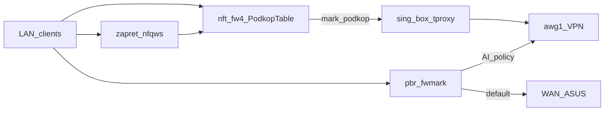

# Xiaomi X3000T (OpenWrt 24.10) — актуальная схема

Справочник по **текущей** домашней конфигурации. Ключи AmneziaWG и пароли в репозиторий не копировать.

**LuCI** с LAN (`192.168.1.0/24`):

- [http://192.168.1.1/](http://192.168.1.1/)
- [http://openwrt.lan/cgi-bin/luci/](http://openwrt.lan/cgi-bin/luci/)

---

## Топология

Провайдер → **ASUS RT-AX55** (`192.168.50.0/24`) → WAN **Xiaomi/OpenWrt** (пример WAN `192.168.50.20/24`) → LAN `192.168.1.0/24` → ПК/телефоны.

Проброс портов и белый IP — на **ASUS**. Разделение трафика, VPN, DPI — на **OpenWrt**. Общий контекст дома: `[hardware-and-env.md](hardware-and-env.md)`.

---

## Прошивка


| Параметр   | Значение                                                              |
| ---------- | --------------------------------------------------------------------- |
| Устройство | Xiaomi X3000T                                                         |
| Система    | **OpenWrt 24.10.6** (`r29141-81be8a8869`), LuCI ветка `openwrt-24.10` |


---

## Цель маршрутизации (как сейчас)

```text
Обычный трафик              → WAN → ASUS → провайдер
Автообход блокировок        → podkop + sing-box (tproxy, списки подсетей)
Выбранные домены / AI API   → pbr: политика «AI Tools via awg1 (global)» → awg1
DPI                         → zapret / nfqws (отдельные mark, не pbr)
Default route               → всегда WAN, не awg1
```

### Кто за что отвечает




- **podkop / sing-box** — основной автоматический обход по community-листам (в т.ч. Telegram и др.); трафик помечается и уходит в цепочку tproxy.
- **pbr** — отдельные политики по доменам → таблица `pbr_awg1` (интерфейс `awg1`).
- **zapret** — модификация потоков под DPI, не заменяет выбор маршрута.

---

## Интерфейсы и маршруты (ориентир)


| Интерфейс | Роль          | Пример                                                               |
| --------- | ------------- | -------------------------------------------------------------------- |
| `wan`     | Uplink к ASUS | `192.168.50.x/24`, шлюз `192.168.50.1`                               |
| `br-lan`  | LAN           | `192.168.1.1/24`                                                     |
| `awg1`    | AmneziaWG     | адрес в туннеле вида `10.8.1.10/32`; **без** default route в туннель |


Проверки:

```sh
ip route
ip rule
ifstatus awg1
```

Ожидаемо: `default via 192.168.50.1 dev wan`; к хосту VPN-сервера — статический маршрут через `wan` (IP см. `[hardware-and-env.md](hardware-and-env.md)`).

---

## pbr (актуально)

Версия **pbr 1.2.2-r14**. Включён, `supported_interface` содержит `awg1`, uplink — `wan`.

**Активная политика (одна, глобальная для LAN):**

- Имя: `**AI Tools via awg1 (global)`**
- Интерфейс: `**awg1**`
- Назначение: список `dest_addr` (Cursor + ряд AI/CDN-доменов). Точный список на роутере: `uci show pbr` → секция `pbr.@policy[0]`.

После правок:

```sh
uci commit pbr
/etc/init.d/pbr restart
/etc/init.d/pbr status
```

Проверка правила в nft (комментарий политики):

```sh
nft list chain inet fw4 pbr_prerouting
```

**dnsmasq** без `nftset`: домены в pbr резолвятся в IP при перезапуске pbr. Если политики «плывут» по IP — поставить `dnsmasq-full` и снова `pbr restart` (см. [документацию pbr](https://docs.openwrt.melmac.ca/pbr/)).

---

## podkop и sing-box

- **podkop** управляет конфигом **sing-box**, списками подсетей, nft `inet PodkopTable` (tproxy на `127.0.0.1:1602` и т.д.).
- В `uci` типично: `podkop.main.connection_type='vpn'`, `podkop.main.interface='awg1'`, community lists.
- Обновление списков: `/usr/bin/podkop list_update` (и cron от podkop, если настроен).

Проверки:

```sh
/usr/bin/podkop get_status
/usr/bin/podkop check_nft_rules
nft list set inet PodkopTable podkop_subnets
/etc/init.d/sing-box status
```

---

## Стабильность после перезагрузки / обрыва питания

### Маршруты к GitHub для обновления списков

С `raw.githubusercontent.com` по WAN иногда таймаут; для **загрузки листов** на роутере заданы маршруты через `awg1`:

- `185.199.108.0/22`
- `140.82.112.0/20`

### Hotplug

Файл: `**/etc/hotplug.d/iface/99-vpn-stack`** (исполняемый).

На `ifup` для `wan` или `awg1`: выставить маршруты GitHub через `awg1`, пауза, затем перезапуск `**sing-box` → `podkop` → `zapret` → `pbr**`.

Откат hotplug и маршрутов — см. раздел **Rollback** в конце.

---

## zapret

Работает отдельно; mark-диапазоны **не** пересекаются с диапазоном pbr (`0x00ff0000`). Не смешивать правила без необходимости.

```sh
/etc/init.d/zapret status
```

---

## Скрипты в этом репозитории

Путь в проекте: `[scripts/openwrt/](scripts/openwrt/)`.


| Файл                                                                                       | Назначение                                                                                                                        |
| ------------------------------------------------------------------------------------------ | --------------------------------------------------------------------------------------------------------------------------------- |
| `[scripts/openwrt/openwrt_exec.py](scripts/openwrt/openwrt_exec.py)`                       | Выполнить одну команду на роутере по SSH с ключом (переменные `OPENWRT_HOST`, `OPENWRT_USER`, `OPENWRT_KEY`, `OPENWRT_KEY_PASS`). |
| `[scripts/openwrt/podkop-subnets-watchdog.sh](scripts/openwrt/podkop-subnets-watchdog.sh)` | Если `podkop_subnets` пуст — вызвать `podkop list_update`; лог `logread -e podkop-watchdog`.                                      |


**Копия watchdog на роутере:** `/usr/bin/podkop-subnets-watchdog.sh`  
**Cron (root):** строка `*/15 * * * * /usr/bin/podkop-subnets-watchdog.sh` (дополнительно к своему cron podkop, если есть).

Пример с ПК (PowerShell, ключ с passphrase в env только локально):

```powershell
$env:OPENWRT_KEY_PASS='...'
python d:\repositories\home-server\scripts\openwrt\openwrt_exec.py "uci show pbr | head"
```

---

## Быстрый health-check

```sh
ip route
ip rule
ifstatus awg1
/etc/init.d/pbr status
/etc/init.d/sing-box status
/etc/init.d/zapret status
/usr/bin/podkop check_nft_rules
nft list set inet PodkopTable podkop_subnets
```

---

## Диагностика с ПК

```powershell
tracert example.com
```

После hop `192.168.1.1` ожидаем для «обычного» сайта шлюз ASUS `192.168.50.1` (WAN-цепочка).

На роутере для конкретного клиента (подставь IP):

```sh
opkg install tcpdump-mini
tcpdump -ni br-lan host 192.168.1.xxx and 'tcp port 443 or udp port 443 or port 53'
```

---

## Rollback стабилизации (hotplug + маршруты GitHub)

```sh
rm -f /etc/hotplug.d/iface/99-vpn-stack
ip route del 185.199.108.0/22 dev awg1 2>/dev/null
ip route del 140.82.112.0/20 dev awg1 2>/dev/null
/etc/init.d/podkop restart
/etc/init.d/sing-box restart
/etc/init.d/zapret restart
/etc/init.d/pbr restart
```

Удаление cron-строки watchdog с роутера — вручную отредактировать `/etc/crontabs/root` и `service cron restart`, если нужно полностью убрать.

---

## Примечание про модели в Cursor

Маршрутизация Cursor/AI через `awg1` настроена политикой выше; если часть моделей (например, Anthropic) не отображается, это может быть **ограничение аккаунта/региона/плана**, а не отсутствие URL в списке. Список `dest_addr` при необходимости дополняется по `tcpdump` / логам клиента.