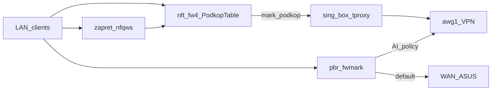
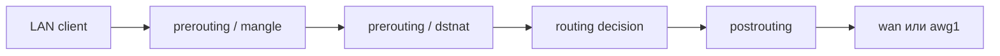
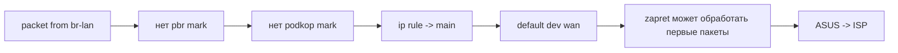
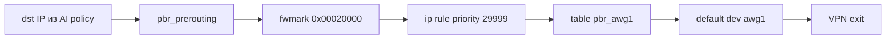
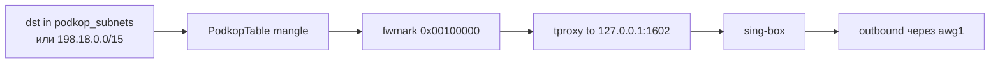
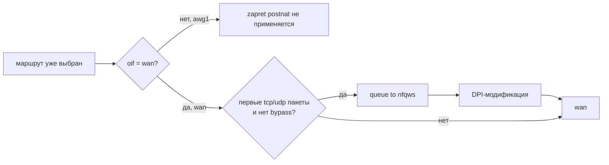

# Xiaomi X3000T (OpenWrt 24.10) — актуальная схема

Справочник по **текущей** домашней конфигурации. Ключи AmneziaWG и пароли в репозиторий не копировать.

**LuCI** с LAN (`192.168.1.0/24`):

- [http://192.168.1.1/](http://192.168.1.1/)
- [http://openwrt.lan/cgi-bin/luci/](http://openwrt.lan/cgi-bin/luci/)

---

## Топология

Провайдер → **ASUS RT-AX55** (`192.168.50.0/24`) → WAN **Xiaomi/OpenWrt** (пример WAN `192.168.50.20/24`) → LAN `192.168.1.0/24` → ПК/телефоны.

Проброс портов и белый IP — на **ASUS**. Разделение трафика, VPN, DPI — на **OpenWrt**. Общий контекст дома: `[hardware-and-env.md](hardware-and-env.md)`.

---

## Прошивка


| Параметр   | Значение                                                              |
| ---------- | --------------------------------------------------------------------- |
| Устройство | Xiaomi X3000T                                                         |
| Система    | **OpenWrt 24.10.6** (`r29141-81be8a8869`), LuCI ветка `openwrt-24.10` |


---

## Цель маршрутизации (как сейчас)

```text
Обычный трафик              → WAN → ASUS → провайдер
Автообход блокировок        → podkop + sing-box (tproxy, списки подсетей)
Выбранные домены / AI API   → pbr: политика «AI Tools via awg1 (global)» → awg1
DPI                         → zapret / nfqws (отдельные mark, не pbr)
Default route               → всегда WAN, не awg1
```

### Кто за что отвечает




- **podkop / sing-box** — основной автоматический обход по community-листам (в т.ч. Telegram и др.); трафик помечается и уходит в цепочку tproxy.
- **pbr** — отдельные политики по доменам → таблица `pbr_awg1` (интерфейс `awg1`).
- **zapret** — модификация потоков под DPI, не заменяет выбор маршрута.

---

## Подробная схема: пакетный разбор

Ниже не “красивая архитектура”, а порядок, в котором OpenWrt реально принимает решения по пакету из LAN. Важная мысль: `pbr`, `podkop` и `zapret` находятся на разных смысловых слоях.

- `pbr` меняет **таблицу маршрутизации** через `fwmark`.
- `podkop` делает **прозрачный прокси-перехват** через `tproxy` в локальный `sing-box`.
- `zapret` делает **DPI-модификацию первых пакетов** через `nfqws`; маршрут он не выбирает.

### Текущие правила маршрутизации

```sh
ip rule
```

Актуальная логика:


| Priority | Условие                               | Таблица    | Что значит                                                           |
| -------- | ------------------------------------- | ---------- | -------------------------------------------------------------------- |
| `105`    | `fwmark 0x100000/0x100000`            | `podkop`   | пакеты, помеченные podkop, обслуживаются его routing/tproxy-логикой  |
| `29998`  | `lookup main suppress_prefixlength 1` | `main`     | оставить локальные/специфичные маршруты из main, но подавить default |
| `29999`  | `fwmark 0x20000/0xff0000`             | `pbr_awg1` | pbr-политика отправляет выбранные цели в `awg1`                      |
| `30000`  | `fwmark 0x10000/0xff0000`             | `pbr_wan`  | pbr-политика может явно вернуть трафик в WAN                         |
| `32766`  | без mark                              | `main`     | обычный fallback: default через `wan`                                |


Ключевые маршруты:

```sh
default via 192.168.50.1 dev wan
89.44.76.52 via 192.168.50.1 dev wan
default via 10.8.1.10 dev awg1 table pbr_awg1
```

Здесь важно, что **default route системы остаётся WAN**. VPN-сервер `89.44.76.52` тоже принудительно доступен через `wan`, чтобы туннель не попытался завернуться сам в себя.

### Стадии обработки пакета из LAN

Для пакета `192.168.1.x → внешний IP` грубая временная линия такая:

```text
LAN packet enters br-lan
  ↓
prerouting / mangle:
  - pbr может поставить mark 0x00020000
  - podkop может поставить mark 0x00100000
  ↓
prerouting / dstnat:
  - podkop proxy chain может сделать tproxy to 127.0.0.1:1602
  - zapret prenat смотрит reply-пакеты со стороны WAN
  ↓
routing decision:
  - ip rule выбирает main / pbr_awg1 / podkop
  ↓
forward / output path
  ↓
postrouting:
  - если выбран oif wan, zapret postnat может отправить первые пакеты в nfqws
  ↓
wan или awg1
```

Та же логика на схемах. Они специально разбиты на маленькие куски: одна большая схема здесь получается нечитаемой.

Общий порядок стадий:




Обычный WAN-трафик:




AI-трафик через `pbr`:




Трафик через `podkop` / `sing-box`:




Где сидит `zapret`:




Главный вывод: `pbr` и `podkop` решают, уйдёт поток в `awg1` или нет. `zapret` появляется позже и только на WAN-ветке: он не выбирает маршрут, а модифицирует первые пакеты уже выбранного WAN-потока.

### Сценарий 1: обычный сайт без правил

Пример: клиент открывает сайт, которого нет ни в pbr-политике, ни в списках podkop.

1. Пакет приходит с `br-lan`.
2. В `pbr_prerouting` нет совпадения по `ip daddr`, mark `0x20000` не ставится.
3. В `PodkopTable mangle` нет совпадения по `podkop_subnets` / `198.18.0.0/15`, mark `0x100000` не ставится.
4. `ip rule` не видит специальных mark и доходит до `lookup main`.
5. В `main` есть `default via 192.168.50.1 dev wan`.
6. На выходе через `wan` пакет может попасть в `zapret postnat`, если подходит по протоколу/порту и не входит в `nozapret`.
7. После этого пакет уходит `wan → ASUS → провайдер`.

Проверка маршрута:

```sh
ip route get <target_ip>
```

Ожидаемо: `dev wan`.

### Сценарий 2: AI-домен из pbr

Пример: `api.openai.com`, `chatgpt.com`, `claude.ai` или другой домен из политики `AI Tools via awg1 (global)`.

1. DNS уже должен превратить домен в IP. В `pbr_prerouting` работают именно IP из текущей policy/set-логики, не строка домена в каждом пакете.
2. Пакет приходит с `br-lan`.
3. `fw4` вызывает `pbr_prerouting` из `mangle_prerouting`.
4. Если `ip daddr` совпал с IP из политики, pbr вызывает `pbr_mark_0x020000`.
5. Эта цепочка ставит mark:

```sh
meta mark set meta mark & 0xff02ffff | 0x00020000
```

1. На routing decision срабатывает правило:

```sh
from all fwmark 0x20000/0xff0000 lookup pbr_awg1
```

1. Таблица `pbr_awg1` даёт:

```sh
default via 10.8.1.10 dev awg1
```

1. Пакет выходит через `awg1` к VPN exit.

Что здесь делает `zapret`: для этого сценария в текущей конфигурации почти ничего полезного. Его ключевые outbound-правила завязаны на `oifname @wanif`, а выбранный интерфейс здесь `awg1`.

Проверка:

```sh
ip route get <target_ip> mark 0x20000
curl -4 --interface awg1 https://api.openai.com
```

### Сценарий 3: podkop / sing-box через tproxy

Пример: IP попал в `podkop_subnets` или в технический диапазон `198.18.0.0/15`, который podkop/sing-box использует для fake-ip/перехвата.

1. Пакет приходит с `br-lan`.
2. В `table inet PodkopTable`, chain `mangle`, срабатывает одно из правил:

```sh
iifname @interfaces ip daddr @podkop_subnets meta l4proto tcp meta mark set 0x00100000
iifname @interfaces ip daddr 198.18.0.0/15 meta l4proto tcp meta mark set 0x00100000
```

1. После этого в chain `proxy` podkop делает tproxy:

```sh
meta mark & 0x00100000 == 0x00100000 meta l4proto tcp tproxy ip to 127.0.0.1:1602
meta mark & 0x00100000 == 0x00100000 meta l4proto udp tproxy ip to 127.0.0.1:1602
```

1. Пакет не просто “маршрутизируется в VPN”. Его перехватывает локальный `sing-box` на `127.0.0.1:1602`.
2. `sing-box` уже сам создаёт исходящее соединение по своему outbound, в этой конфигурации через `awg1`.
3. Поэтому podkop — это не pbr-таблица маршрутизации, а прозрачный прокси-слой.

Проверка:

```sh
/usr/bin/podkop get_status
/usr/bin/podkop check_nft_rules
nft list table inet PodkopTable
```

### Сценарий 4: где именно вмешивается zapret

`zapret` не отвечает на вопрос “WAN или awg1?”. Он включается позже, когда для потока уже выбран WAN, и пытается сделать поток менее понятным для DPI.

На роутере это видно по `table inet zapret`:

```sh
set wanif {
    type ifname
    elements = { "wan" }
}
```

Outbound-часть:

```sh
chain postnat {
    ct original ip saddr 192.168.1.147 return comment "zapret-ct-bypass-147"
    oifname @wanif udp ... meta mark set meta mark | 0x20000000 ct mark set ct mark | 0x40000000 queue flags bypass to 65400
    oifname @wanif udp dport ... ct original packets 1-9 ... queue flags bypass to 200
    oifname @wanif tcp dport ... ct original packets 1-9 ... queue flags bypass to 200
}
```

Что это значит по пакетам:

1. Пакет уже дошёл до стадии postrouting.
2. У него уже есть выбранный выходной интерфейс.
3. Правило `oifname @wanif` пропускает только те потоки, которые выходят через `wan`.
4. Для первых пакетов соединения (`ct original packets 1-9`) zapret ставит служебные marks и отправляет пакет в queue `nfqws`.
5. `nfqws` модифицирует пакет и возвращает его обратно в kernel.
6. Пакет продолжает уходить через `wan`.

Inbound/reply-часть:

```sh
chain prenat {
    ct reply ip daddr 192.168.1.147 return comment "zapret-ct-bypass-147-pre"
    iifname @wanif tcp sport ... ct reply packets 1-3 ... queue flags bypass to 200
}
```

Это симметричная обработка ранних ответных пакетов со стороны WAN.

Почему `zapret` может ломать приложения:

- он вмешивается не в маршрут, а в байты/фрагментацию/поведение ранних пакетов;
- некоторые приложения, игры, мессенджеры или банковские клиенты могут плохо переносить такую модификацию;
- поэтому bypass делается именно в `table inet zapret`, через ранний `return` по conntrack-адресу клиента.

Для `192.168.1.147` сейчас есть bypass:

```sh
ct original ip saddr 192.168.1.147 return
ct reply ip daddr 192.168.1.147 return
```

### Mark-и почему они не должны пересекаться


| Компонент          | Mark / ct mark             | Где используется                                   | Зачем                                               |
| ------------------ | -------------------------- | -------------------------------------------------- | --------------------------------------------------- |
| `pbr`              | `0x20000/0xff0000`         | `ip rule`, table `pbr_awg1`                        | выбрать маршрут через `awg1`                        |
| `podkop`           | `0x00100000`               | `PodkopTable mangle/proxy`, `ip rule priority 105` | пометить трафик для tproxy/sing-box                 |
| `zapret` / `nfqws` | `0x20000000`, `0x40000000` | `table inet zapret`, conntrack                     | отметить nfqws-обработку и не гонять пакет повторно |


Если эти диапазоны случайно пересечь, можно получить очень неприятные эффекты: pbr будет считать чужой пакет своим, podkop перехватит не тот поток, или zapret начнёт повторно обрабатывать уже модифицированный пакет.

---

## Интерфейсы и маршруты (ориентир)


| Интерфейс | Роль          | Пример                                                               |
| --------- | ------------- | -------------------------------------------------------------------- |
| `wan`     | Uplink к ASUS | `192.168.50.x/24`, шлюз `192.168.50.1`                               |
| `br-lan`  | LAN           | `192.168.1.1/24`                                                     |
| `awg1`    | AmneziaWG     | адрес в туннеле вида `10.8.1.10/32`; **без** default route в туннель |


Проверки:

```sh
ip route
ip rule
ifstatus awg1
```

Ожидаемо: `default via 192.168.50.1 dev wan`; к хосту VPN-сервера — статический маршрут через `wan` (IP см. `[hardware-and-env.md](hardware-and-env.md)`).

---

## pbr (актуально)

Версия **pbr 1.2.2-r14**. Включён, `supported_interface` содержит `awg1` и `workvpn`, uplink — `wan`.

**Активные политики:**

- Имя: `AI Tools via awg1 (global)`
- Интерфейс: `awg1`
- Назначение: список `dest_addr` (Cursor + ряд AI/CDN-доменов). Точный список на роутере: `uci show pbr` → секция `pbr.@policy[0]`.
- Имя: `paul-mac kpb via workvpn`
- Интерфейс: `workvpn`
- `src_addr`: `192.168.1.198`
- Назначение: `kpb.lt`, `*.kpb.lt`, `gitlab.kpb.lt`, `10.0.160.0/22`.

После правок:

```sh
uci commit pbr
/etc/init.d/pbr restart
/etc/init.d/pbr status
```

Проверка правила в nft (комментарий политики):

```sh
nft list chain inet fw4 pbr_prerouting
```

**dnsmasq-full + nftset** включён. Доменные политики pbr работают через nft-наборы; проверка: `/etc/init.d/pbr status` (блок `dnsmasq nft sets`).

---

## Corporate OpenConnect (`workvpn`)

Сценарий: корпоративные ресурсы `kpb.lt` для одного устройства (`paul-mac`) идут через `workvpn`, остальная сеть продолжает жить как раньше.

Текущее состояние:

- Интерфейс `network.workvpn`:
  - `proto='openconnect'`
  - `interface='wan'`
  - `defaultroute='1'`
  - `metric='500'` (WAN остаётся приоритетным default для системы)
  - `peerdns='0'`
- В `pbr` отдельная политика `paul-mac kpb via workvpn`.
- В `dnsmasq`:
  - `server=/kpb.lt/10.0.160.1`
  - `rebind-domain-ok=kpb.lt` (иначе приватные ответы вида `10.x.x.x` отбрасываются как rebinding)
- В firewall:
  - redirects `force-dns-paul-udp` и `force-dns-paul-tcp`
  - только для `src_ip=192.168.1.198`, принудительный DNS `:53 -> 192.168.1.1:53`
  - это нужно, если клиент использует другой DNS (например `100.100.100.100`) и обходит роутерный resolver.

Проверки:

```sh
ifstatus workvpn
/etc/init.d/pbr status
nslookup gitlab.kpb.lt 192.168.1.1
ip route show table pbr_workvpn
```

Минимальный rollback corporate-части:

```sh
uci set pbr.@policy[1].enabled='0'
uci commit pbr
/etc/init.d/pbr restart
```

---

## podkop и sing-box

- **podkop** управляет конфигом **sing-box**, списками подсетей, nft `inet PodkopTable` (tproxy на `127.0.0.1:1602` и т.д.).
- В `uci` типично: `podkop.main.connection_type='vpn'`, `podkop.main.interface='awg1'`, community lists.
- Обновление списков: `/usr/bin/podkop list_update` (и cron от podkop, если настроен).

Проверки:

```sh
/usr/bin/podkop get_status
/usr/bin/podkop check_nft_rules
nft list set inet PodkopTable podkop_subnets
/etc/init.d/sing-box status
```

---

## Стабильность после перезагрузки / обрыва питания

### Маршруты к GitHub для обновления списков

С `raw.githubusercontent.com` по WAN иногда таймаут; для **загрузки листов** на роутере заданы маршруты через `awg1`:

- `185.199.108.0/22`
- `140.82.112.0/20`

### Hotplug

Файл: `**/etc/hotplug.d/iface/99-vpn-stack`** (исполняемый).

На `ifup` для `wan` или `awg1`: выставить маршруты GitHub через `awg1`, пауза, затем перезапуск `**sing-box` → `podkop` → `zapret` → `pbr`**.

Откат hotplug и маршрутов — см. раздел **Rollback** в конце.

---

## zapret

`zapret` — это не VPN и не policy routing. В этой схеме он нужен для DPI-обхода на WAN-потоках: первые пакеты соединения отправляются в `nfqws`, где применяются техники обхода DPI. После этого поток продолжает идти по уже выбранному маршруту.

Почему он особняком:

- `pbr` выбирает маршрут через `fwmark 0x20000` и таблицу `pbr_awg1`;
- `podkop` перехватывает трафик через `tproxy` и выпускает его через `sing-box`;
- `zapret` работает в `table inet zapret`, цепляет WAN-потоки через `postnat` / `prenat` и queue в `nfqws`;
- текущие правила `zapret` ограничены `wanif = "wan"`, поэтому это слой DPI-обработки для WAN, а не механизм отправки трафика в `awg1`.

Служебные mark-диапазоны **не** пересекаются с диапазоном pbr (`0x00ff0000`):


| Компонент          | Mark / ct mark             | Назначение                                       |
| ------------------ | -------------------------- | ------------------------------------------------ |
| `pbr`              | `0x20000/0xff0000`         | выбрать таблицу маршрутизации `pbr_awg1`         |
| `zapret` / `nfqws` | `0x20000000`, `0x40000000` | отметить обработанные/связанные с `nfqws` пакеты |


Не смешивать эти правила без необходимости: если `zapret` ломает конкретное приложение, правильнее делать bypass в `table inet zapret`, а не менять pbr-политику.

```sh
/etc/init.d/zapret status
nft list table inet zapret
```

### Per-device bypass для zapret (стабильный вариант)

Если конкретному телефону нужно оставить `zapret` включённым для всей сети, но исключить DPI-обработку только для этого устройства:

- Используется bypass по **conntrack IP клиента** в `table inet zapret` (`postnat` + `prenat`):
  - `ct original ip saddr <client_ip> return`
  - `ct reply ip daddr <client_ip> return`
- Для стабильности IP должен быть закреплён в DHCP host reservation.
- Текущее состояние:
  - bypass включён для `192.168.1.147` (`Redmi-Note-9-Pro`);
  - `192.168.1.240` из bypass убран (резервация DHCP оставлена).

Персистентность после `zapret restart` и ребута:

- hook в `/opt/zapret/config`:
  - `INIT_FW_POST_UP_HOOK=/opt/zapret/custom.bypass_devices.sh`
- скрипт `/opt/zapret/custom.bypass_devices.sh` добавляет bypass-правила, если их нет.
- После `reboot`/отключения питания правила должны подняться автоматически через этот hook.

Быстро добавить ещё одно устройство в bypass (пример `192.168.1.240`):

```sh
nft insert rule inet zapret postnat ct original ip saddr 192.168.1.240 return comment "zapret-ct-bypass-240"
nft insert rule inet zapret prenat ct reply ip daddr 192.168.1.240 return comment "zapret-ct-bypass-240-pre"
```

Проверка:

```sh
nft list chain inet zapret postnat
nft list chain inet zapret prenat
```

Ожидаемо в выводе:

- `ct original ip saddr 192.168.1.147 return comment "zapret-ct-bypass-147"`
- `ct reply ip daddr 192.168.1.147 return comment "zapret-ct-bypass-147-pre"`

Быстрая проверка после отключения света/ребута:

```sh
/etc/init.d/zapret status
/etc/init.d/podkop status
/etc/init.d/sing-box status
/etc/init.d/pbr status
nft list chain inet zapret postnat | grep zapret-ct-bypass-147
nft list chain inet zapret prenat | grep zapret-ct-bypass-147-pre
```

---

## Скрипты в этом репозитории

Путь в проекте: `[scripts/openwrt/](scripts/openwrt/)`.


| Файл                                                                                       | Назначение                                                                                                                                                                                   |
| ------------------------------------------------------------------------------------------ | -------------------------------------------------------------------------------------------------------------------------------------------------------------------------------------------- |
| `[scripts/openwrt/openwrt_exec.py](scripts/openwrt/openwrt_exec.py)`                       | Выполнить одну команду на роутере по SSH с ключом без passphrase (переменные `OPENWRT_HOST`, `OPENWRT_USER`, `OPENWRT_KEY`).                                                                 |
| `[scripts/openwrt/check_stack.py](scripts/openwrt/check_stack.py)`                         | Быстрый health-check стека (`pbr`/`podkop`/`sing-box`/`zapret` + `workvpn` + bypass-правила) через SSH; проверяет egress через `awg1` и `workvpn` (`gitlab.kpb.lt`).                      |
| `[scripts/openwrt/trace_traffic.py](scripts/openwrt/trace_traffic.py)`                     | Трассировка, как конкретный домен/IP обрабатывается pbr/podkop/zapret (куда реально уйдёт трафик и почему).                                                                                |
| `[scripts/openwrt/podkop-subnets-watchdog.sh](scripts/openwrt/podkop-subnets-watchdog.sh)` | Если `podkop_subnets` пуст — вызвать `podkop list_update`; лог `logread -e podkop-watchdog`.                                                                                                 |
| `[start.py](start.py)`                                                                      | Центральный запускатор из корня: показывает доступные скрипты, параметры запуска и умеет запускать их без длинных путей.                                                                    |


**Копия watchdog на роутере:** `/usr/bin/podkop-subnets-watchdog.sh`  
**Cron (root):** строка `*/15 * * * * /usr/bin/podkop-subnets-watchdog.sh` (дополнительно к своему cron podkop, если есть).

Пример с ПК (PowerShell, терминал открыт в корне репозитория):

```powershell
python start.py list
python start.py check_stack
python start.py openwrt_exec "uci show pbr | head"
python start.py trace_traffic gitlab.kpb.lt api.openai.com
```

---

## Быстрый health-check

```sh
ip route
ip rule
ifstatus awg1
/etc/init.d/pbr status
/etc/init.d/sing-box status
/etc/init.d/zapret status
/usr/bin/podkop check_nft_rules
nft list set inet PodkopTable podkop_subnets
```

---

## Диагностика с ПК

```powershell
tracert example.com
```

После hop `192.168.1.1` ожидаем для «обычного» сайта шлюз ASUS `192.168.50.1` (WAN-цепочка).

На роутере для конкретного клиента (подставь IP):

```sh
opkg install tcpdump-mini
tcpdump -ni br-lan host 192.168.1.xxx and 'tcp port 443 or udp port 443 or port 53'
```

---

## Rollback стабилизации (hotplug + маршруты GitHub)

```sh
rm -f /etc/hotplug.d/iface/99-vpn-stack
ip route del 185.199.108.0/22 dev awg1 2>/dev/null
ip route del 140.82.112.0/20 dev awg1 2>/dev/null
/etc/init.d/podkop restart
/etc/init.d/sing-box restart
/etc/init.d/zapret restart
/etc/init.d/pbr restart
```

Удаление cron-строки watchdog с роутера — вручную отредактировать `/etc/crontabs/root` и `service cron restart`, если нужно полностью убрать.

---

## Примечание про модели в Cursor

Маршрутизация Cursor/AI через `awg1` настроена политикой выше; если часть моделей (например, Anthropic) не отображается, это может быть **ограничение аккаунта/региона/плана**, а не отсутствие URL в списке. Список `dest_addr` при необходимости дополняется по `tcpdump` / логам клиента.